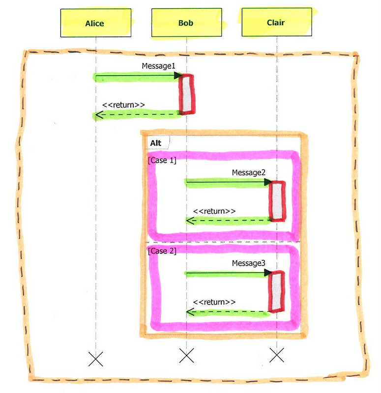

# Model

## Drawing Annotation
Model is a data structure which stores diagram elements.
Drawings below visualize how different diagram elements correspond to model classes.
Diagram **elements** and **classes** which represent them have **same color**.
Class diagram also includes inheritance, aggregation and association relations.

## Basic Idea
# Sequence diagram has life lines called {{Participants}}
# Sequence diagram consist of {{DiagramElement}}-s
# One or many {{DiagramElement}}-s are place in {{InteractionOperand}} which is contained in a {{CombineFragement}}
# Sequence diagram contains one default fragment {{RootCombineFragemnt}} with one {{InteractionOperand}}.
# {{SignalElement}} is a call (an arrow) from one participant. It applies two participants and can be placed inside {{InteractionOperand}}
# {{LifelineStatusElement}} is an activation or deactivation it applies to participant and can be placed inside {{InteractionOperand}}

## Sample Sequence Diagram

## Model Classes of our Sequence Diagram
