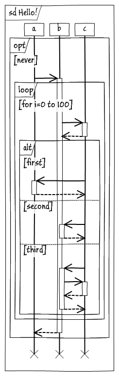
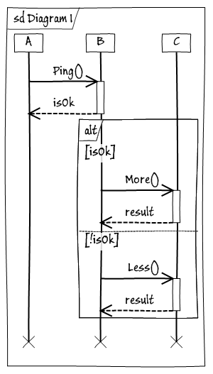
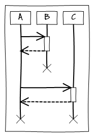

Nested combined fragments
{{
title Hello!
opt never
a->b
activate b
loop for i=0 to 100
b->c
activate c
c-->b
deactivate c
alt first
c->a
activate a
a-->c
deactivate a
else second
c->b
activate b
b-->c
deactivate b
else third
c->b
activate b
b->c
activate c
c-->b
deactivate c
b-->c
deactivate b
end
end
b-->a
deactivate b
end
}}

Nested activation
{{
title Diagram 1
A->B : Ping()
activate B
B->C : call C
activate C
C->B
activate B
b-->c
deactivate B
c->B
deactivate C
b-->A
deactivate B
}}

				
Big sample
{{
title Diagram 1
A->B : Ping()
activate B
B-->A : isOk
deactivate B
alt isOk
B->C : More()
activate C
C-->B : result
deactivate C
else !isOk
B->C : Less()
activate C
C-->B : result
deactivate C
end
}}

Dispose
{{
A->B
activate B
B-->A
deactivate B
dispose B
A->C
activate C
C-->A
deactivate C
}}

				